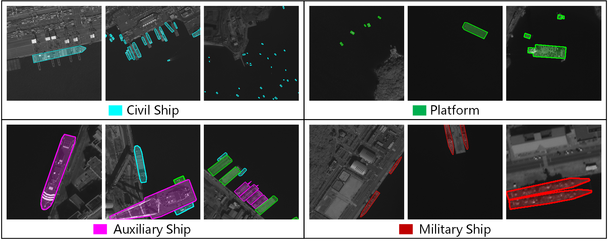
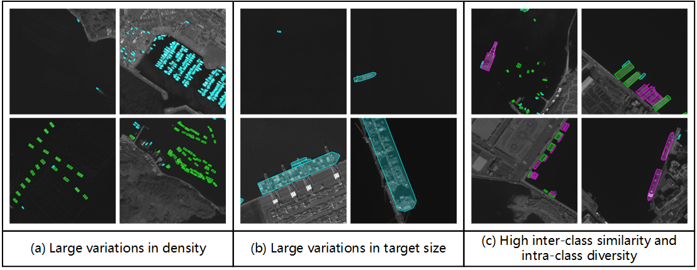

# SISP: A Benchmark Dataset for Fine-grained Ship Instance Segmentation in Panchromatic Satellite Images

> Arxiv Preprint will be uploaded soon! ✨

## Abstart

Fine-grained ship instance segmentation in satellite images holds considerable significance for monitoring maritime activities at sea. However, existing datasets often suffer from the scarcity of fine-grained information or pixel-wise localization annotations, as well as the insufficient image diversity and variations, thus limiting the research of this task. To this end, we propose a benchmark dataset for fine-grained **S**hip **I**nstance **S**egmentation in **P**anchromatic satellite images, namely **SISP**, which contains 56,693 well-annotated ship instances with four fine-grained categories across 10,000 sliced images, and all the images are collected from SuperView-1 satellite with the resolution of 0.5m. Targets in the proposed SISP dataset have characteristics that are consistent with real satellite scenes, such as high class imbalance, various scenes, large variations in target densities and scales, and high inter-class similarity and intra-class diversity, all of which make the SISP dataset more suitable for real-world applications. In addition, we introduce a Dynamic Feature Refinement-assist Instance segmentation network, namely DFRInst, as the benchmark method for ship instance segmentation in satellite images, which can fortify the explicit representation of crucial features, thus improving the performance of ship instance segmentation. Experiments and analysis are performed on the proposed SISP dataset to evaluate the benchmark method and several state-of-the-art methods to establish baselines for facilitating future research. The proposed dataset and source codes are available at: [https://github.com/Justlovesmile/SISP](https://github.com/Justlovesmile/SISP).

## Code Libraries

All the benchmark methods are collected from the open source code libraries, such as [detectron2](https://github.com/facebookresearch/detectron2), [mmdetection](https://github.com/open-mmlab/mmdetection) and [AdelaiDet](https://github.com/aim-uofa/AdelaiDet).

## SISP Dataset

The dataset will be uploaded soon! ✨